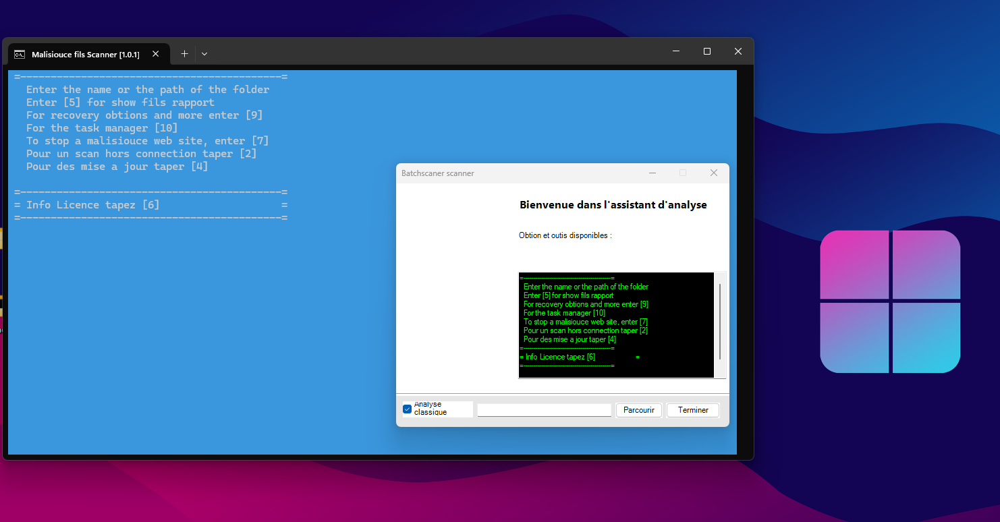
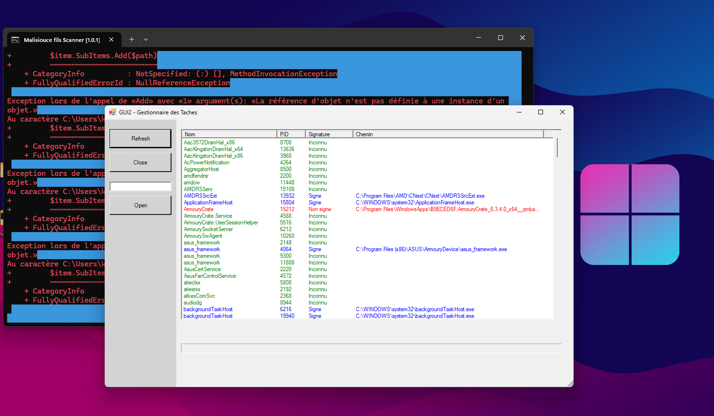
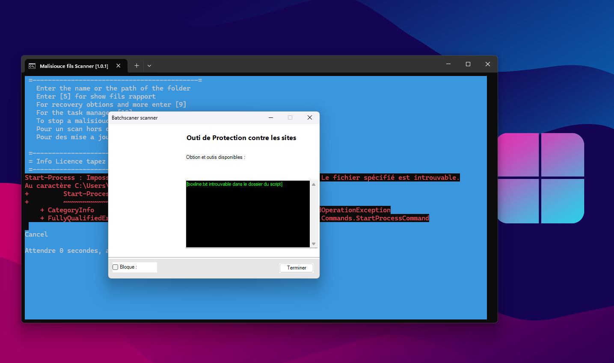
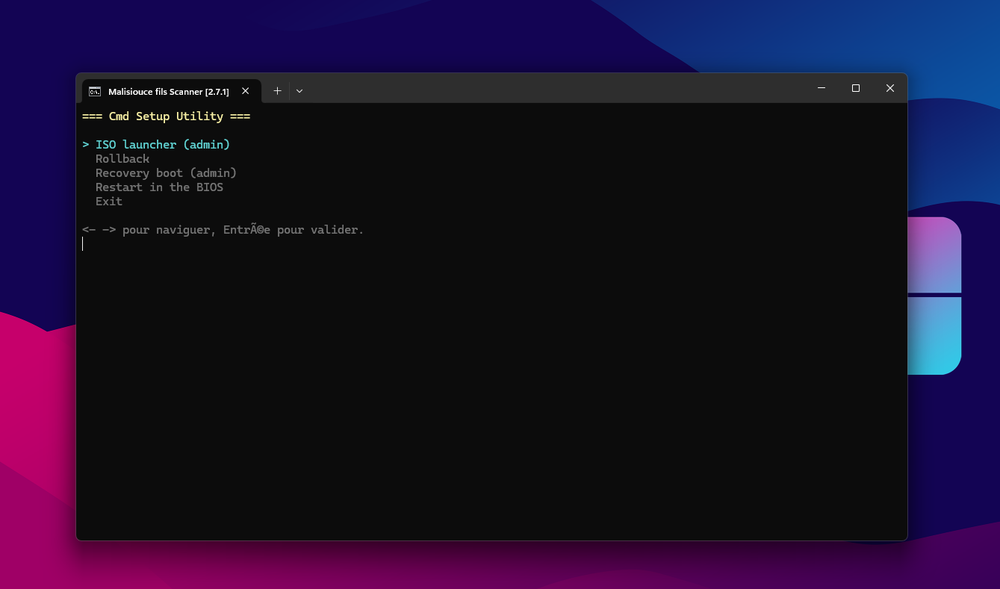
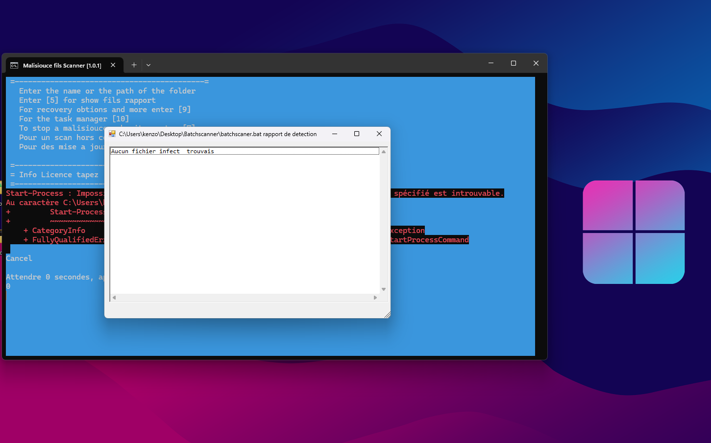
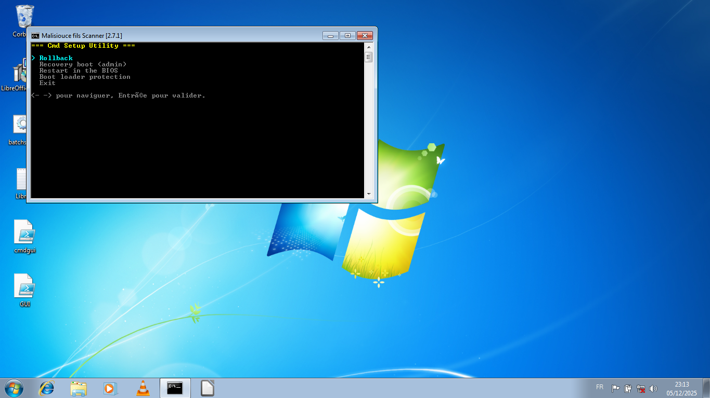
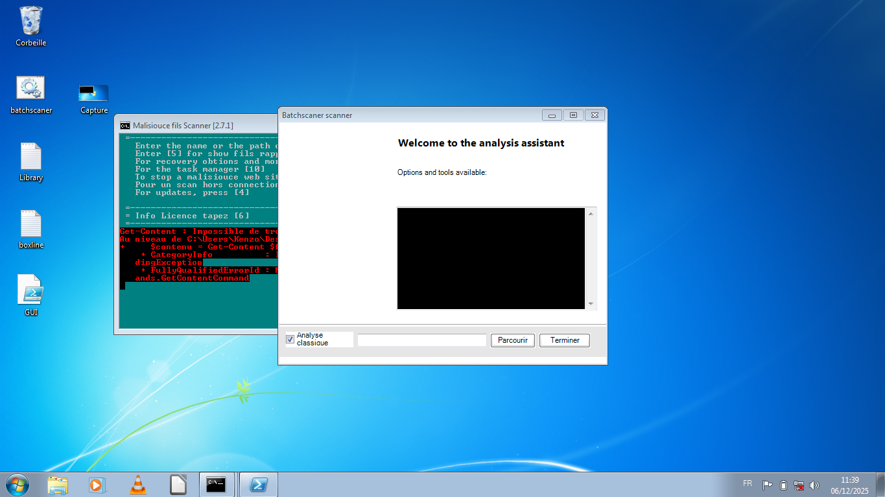
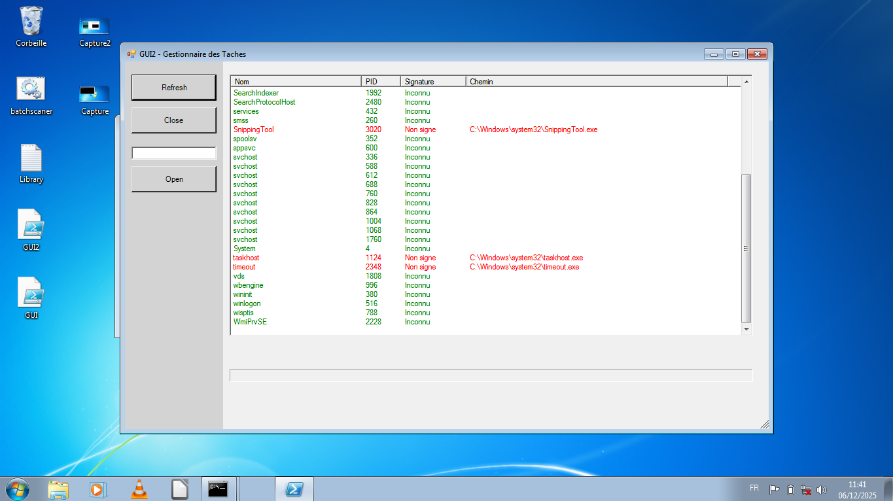
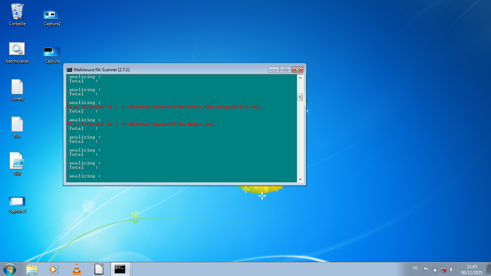

# BatchscannerAntivirus
Ce programme a été créer pour fonctionner sans dépendance et étre léger cette outils et fait en batch et au niveau de la compatibilité il fonction sous Windows 7 et plus !
Ce programme et gratuit et open source !

Lien licence : https://creativecommons.org/licenses/by-nc/4.0/legalcode

stat : vertion 2.8

SubvisionKenzo (c) Copyright 2025

Capture d'ecran du projet :

Windows 7 :

